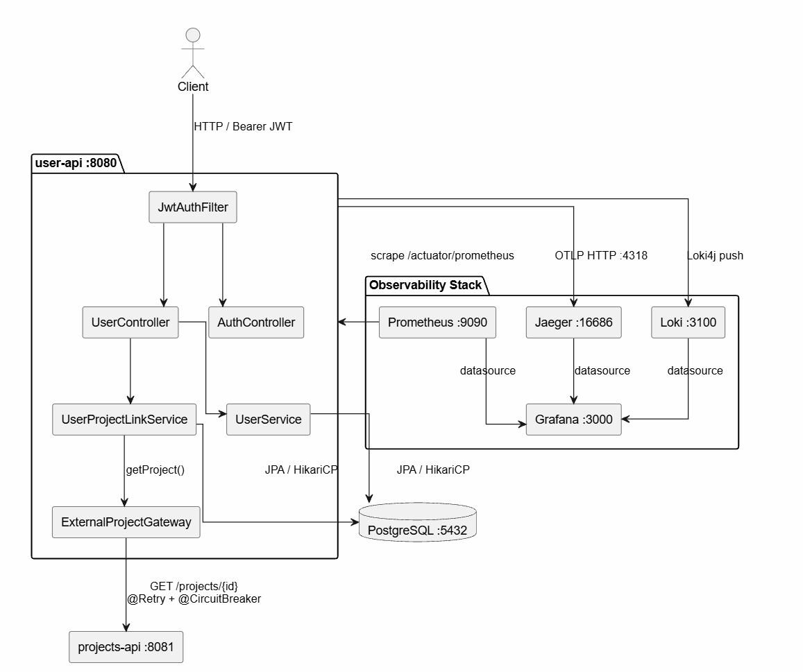
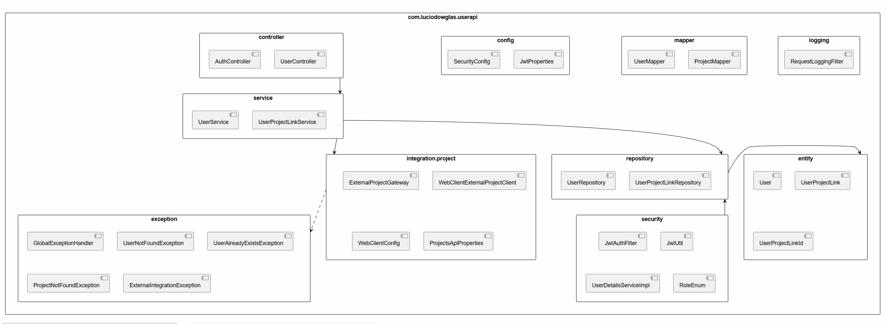
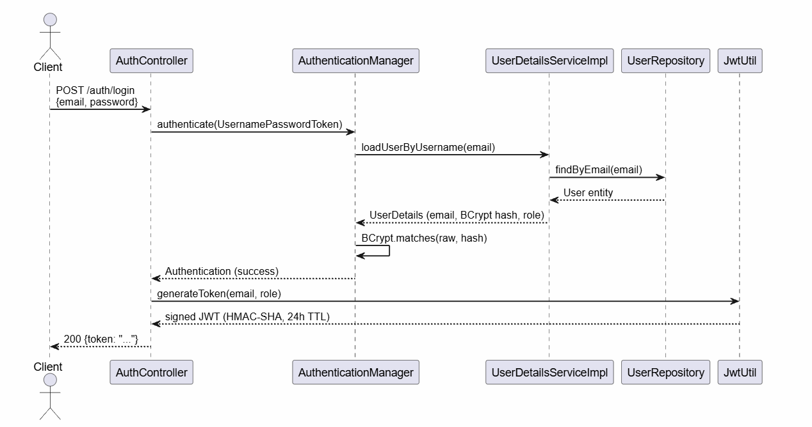
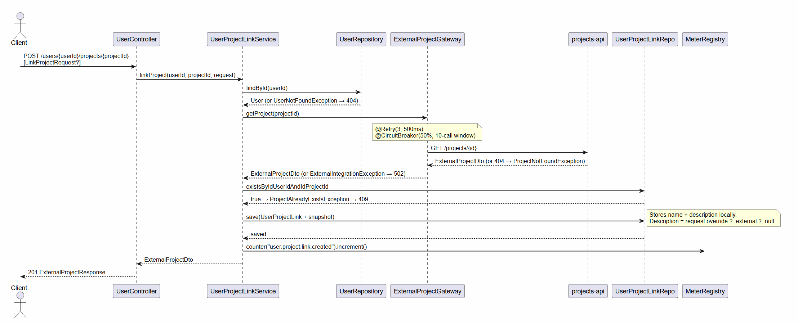

# user-api

REST API for user management and external project association, built with Java 21 and Spring Boot 3.3 as part of a microservice ecosystem.

---

## Technologies


-000000?style=flat-square&logo=jsonwebtokens&logoColor=white)


---

## AI-Assisted Development

This project used [**Claude Code**](https://claude.ai/code) — Anthropic's AI CLI — as a development assistant throughout the engineering process.

| Area | Claude Code contribution |
|---|---|
| **Project structure** | Layered architecture design, package conventions, Spring Boot patterns |
| **Unit tests** | Behaviour-driven test naming, Mockito scenarios, edge-case coverage for `UserService`, `UserController`, `GlobalExceptionHandler` and more |
| **Business rules** | Role-based access control enforcement (`ROLE_ADMIN` creation guard), `AdminUserSeeder` idempotency strategy |
| **Postman collection** | Full request suite with dynamic variables, pre-request scripts, automated assertions and teardown logic |
| **Documentation** | README structure, Javadoc for security-sensitive components, OpenAPI description |

> Claude Code acted as a pair-programmer — every suggestion was reviewed, adjusted, and validated by the development team before being committed.

---

## Project Overview

**user-api** manages the user domain within a microservice architecture. It owns user identity, authentication, and the association between users and external projects sourced from a companion service (`projects-api`).

| Responsibility | Details |
|---|---|
| User CRUD | Create, read, update, delete users with pagination |
| Authentication | JWT Bearer token issuance and validation |
| Authorization | Role-based access control (ROLE_USER, ROLE_ADMIN) |
| Project association | Link/unlink users to external projects via projects-api |
| Project snapshot | Cache project metadata locally at link time; reads never call projects-api |
| Resilience | Retry + circuit breaker on all projects-api calls |
| Observability | Structured logs, distributed traces, Prometheus metrics, Grafana dashboards |

**This service does not own project data.** Projects exist exclusively in `projects-api`; user-api only persists the association plus a point-in-time snapshot of the project's display fields.

---

## Architecture Overview

### Architectural Style

**Layered Architecture** with an **Anti-Corruption Layer (ACL)** for external service integration.

```
Controller  →  Service  →  Repository  →  PostgreSQL
                  ↓
         ExternalProjectGateway  (ACL)
                  ↓
         WebClientExternalProjectClient
                  ↓
            projects-api  (external)
```

| Layer | Package | Responsibility |
|---|---|---|
| Controller | `controller/` | HTTP endpoint binding, request/response mapping |
| Service | `service/` | Business logic, orchestration, transaction boundaries |
| Repository | `repository/` | Data access via Spring Data JPA |
| Entity | `entity/` | JPA domain models, optimistic locking |
| Integration / ACL | `integration/project/` | Anti-corruption layer, external HTTP client, resilience |
| Security | `security/` | JWT filter chain, UserDetails, role model |
| Config | `config/` | Security bean wiring, JWT properties |
| Exception | `exception/` | Domain exceptions, global RFC 7807 handler |
| Mapper | `mapper/` | Entity ↔ DTO transformations |
| Logging | `logging/` | Correlation ID propagation via MDC |

### Key Design Decisions

- **API-First**: OpenAPI 3.1 spec (`openapi/user-api.yaml`) is the source of truth; controller interfaces and DTOs are code-generated by the Maven `openapi-generator-maven-plugin`.
- **Snapshot Pattern**: On project link creation, the project's `name` and `description` are stored locally in `tb_user_external_project`. `GET /users/{id}/projects` reads the snapshot — no network call required.
- **Optimistic Locking**: `@Version` on both `User` and `UserProjectLink` prevents concurrent silent overwrites; conflicts surface as HTTP 409.
- **Virtual Threads** (Java 21): `spring.threads.virtual.enabled=true` — all web and async workloads run on lightweight virtual threads.
- **Dependency Injection**: Constructor injection via Lombok `@RequiredArgsConstructor` throughout.

---

### System Architecture Diagram


---

### Package Structure Diagram


---

## API Reference

**Base URL:** `http://localhost:8080/api/v1`  
**Auth:** `Authorization: Bearer <JWT>` on all protected endpoints.

### Authentication

| Method | Path | Auth | Status Codes | Description |
|---|---|---|---|---|
| POST | `/auth/login` | Public | 200, 401, 500 | Authenticate and receive JWT |

**Request:**
```json
{ "email": "admin@userapi.com", "password": "Admin@1234" }
```

**Response:**
```json
{ "token": "<JWT>" }
```

---

### Users

| Method | Path | Auth | Status Codes | Description |
|---|---|---|---|---|
| POST | `/users` | Public | 201, 400, 403, 409, 429, 500 | Register user |
| GET | `/users` | Required | 200, 429, 500 | List users (paginated, sorted by name) |
| GET | `/users/{id}` | Required | 200, 404, 429, 500 | Get user by UUID |
| PUT | `/users/{id}` | Required | 200, 400, 404, 409, 429, 500 | Update user (partial) |
| DELETE | `/users/{id}` | ADMIN only | 204, 403, 404, 429, 500 | Delete user |

**`POST /users` — `role` field rules:**

| Requested role | Caller auth | Result |
|---|---|---|
| `ROLE_USER` or omitted | Any / none | 201 Created |
| `ROLE_ADMIN` | Authenticated as `ROLE_ADMIN` | 201 Created |
| `ROLE_ADMIN` | Unauthenticated or `ROLE_USER` | 403 Forbidden |

**Query parameters for `GET /users`:**

| Param | Type | Default | Constraints | Description |
|---|---|---|---|---|
| `page` | integer | 0 | ≥ 0 | Page index (zero-based) |
| `size` | integer | 20 | 1–100 | Page size |

---

### Project Links

| Method | Path | Auth | Status Codes | Description |
|---|---|---|---|---|
| GET | `/users/{id}/projects` | Required | 200, 404, 429, 500 | List user's linked projects (snapshot) |
| POST | `/users/{userId}/projects/{projectId}` | Required | 201, 404, 409, 429, 502, 500 | Link external project to user |
| DELETE | `/users/{userId}/projects/{projectId}` | Required | 204, 404, 429, 500 | Unlink project from user |

**Optional body for `POST /users/{userId}/projects/{projectId}`:**
```json
{ "description": "custom note overriding the project's default description" }
```

**Error responses** follow RFC 7807 (`application/problem+json`) with fields: `type`, `title`, `status`, `detail`, `instance`, `traceId`, `correlationId`. Validation errors include an `errors` array of `{field, message}` objects.

---

## Request Flow Diagrams

### Authentication Flow


---

### Link Project Flow


---

## Security

### Authentication & Authorization Model

| Concern | Implementation |
|---|---|
| Token format | JWT signed with HMAC-SHA (JJWT 0.12.6) |
| Token claims | Subject: email · Custom claim: role |
| Token TTL | 24 hours (configurable via `JWT_EXPIRATION_MS`) |
| Password hashing | BCrypt strength 12 |
| Session policy | Stateless (no server-side session) |
| CSRF | Disabled (stateless REST API) |

### Endpoint Access Matrix

| Endpoint | Auth Required | Required Role |
|---|---|---|
| `POST /auth/login` | No | — |
| `POST /users` | No | — |
| `GET /actuator/**` | No | — |
| `GET /swagger-ui/**` | No | — |
| `GET /users` | Yes | ROLE_USER or ROLE_ADMIN |
| `GET /users/{id}` | Yes | ROLE_USER or ROLE_ADMIN |
| `PUT /users/{id}` | Yes | ROLE_USER or ROLE_ADMIN |
| `DELETE /users/{id}` | Yes | **ROLE_ADMIN only** |
| `GET /users/{id}/projects` | Yes | ROLE_USER or ROLE_ADMIN |
| `POST /users/{userId}/projects/{projectId}` | Yes | ROLE_USER or ROLE_ADMIN |
| `DELETE /users/{userId}/projects/{projectId}` | Yes | ROLE_USER or ROLE_ADMIN |

### JWT Filter Chain

```
Request
  └─► JwtAuthFilter (OncePerRequestFilter)
        ├─ Extract Bearer token from Authorization header
        ├─ Validate signature + expiry (JwtUtil)
        ├─ Load UserDetails (UserDetailsServiceImpl → DB)
        ├─ Set SecurityContextHolder
        └─► Next filter → Controller
```

---

## Resilience

All outbound calls to `projects-api` are protected by Resilience4j, applied in `ExternalProjectGateway`.

| Pattern | Configuration | Scope |
|---|---|---|
| **Rate Limiter** | 50 requests/second | All user-api endpoints |
| **Retry** | 3 attempts, 500ms wait; ignores `ProjectNotFoundException` | projects-api calls |
| **Circuit Breaker** | 50% failure threshold · 10-call sliding window · 30s open · 3 probe calls half-open | projects-api calls |
| **Connect Timeout** | 2 000 ms | projects-api WebClient |
| **Response Timeout** | 3 000 ms | projects-api WebClient |

**Failure behavior:**
- `ProjectNotFoundException` from projects-api propagates as HTTP 404 — not retried.
- Any other upstream error is wrapped as `ExternalIntegrationException` → HTTP 502.
- Rate limit exceeded → HTTP 429.

**Check circuit breaker state:**
```bash
curl http://localhost:8080/api/v1/actuator/health | jq .components.circuitBreakers
```

---

### Schema Notes

| Aspect | Detail |
|---|---|
| UUID generation | `gen_random_uuid()` via pgcrypto extension |
| Migrations | Flyway · `src/main/resources/db/migration/V1__init.sql` |
| DDL strategy | `validate` (Flyway owns schema, Hibernate validates only) |
| Optimistic locking | `@Version` on both entities; concurrent modification → HTTP 409 |
| Connection pool | HikariCP · max 10 · min idle 2 · 30s conn timeout |
| Batch writes | Hibernate batch size 25 |
| Indexes | `idx_user_email(email)` · `idx_project_user(user_id)` |

---

## Observability

The full observability stack starts automatically with Docker Compose. No extra configuration required.

### Services

| Tool | URL | Purpose                                                               |
|---|---|-----------------------------------------------------------------------|
| Grafana | http://localhost:3000 | Dashboards (metrics + logs + traces) (USER: admin , PASSWORD: admin) |
| Prometheus | http://localhost:9090 | Metrics aggregation and querying                                      |
| Jaeger | http://localhost:16686 | Distributed trace explorer                                            |
| Loki | http://localhost:3100 | Log storage (time-series)                                             |
| Actuator | http://localhost:8080/api/v1/actuator | Health, metrics, loggers, httpexchanges                               |

---

### Metrics

Prometheus scrapes `/api/v1/actuator/prometheus` every 15 seconds.

| Metric | Description |
|---|---|
| `http_server_requests_seconds_*` | HTTP request count + latency histogram (SLOs: 50/100/200/500ms, 1s, 2s) |
| `jvm_memory_used_bytes` | JVM heap and non-heap usage |
| `jvm_threads_live_threads` | Active thread count |
| `process_cpu_usage` | Process CPU percentage |
| `hikaricp_connections_active` | Active database connections |
| `resilience4j_circuitbreaker_state` | Circuit breaker state (CLOSED / OPEN / HALF_OPEN) |
| `user_project_link_created_total` | Business metric: total project links created |
| `external_project_lookup_duration_seconds` | Gateway call latency histogram |
| `external_project_lookup_failure_total` | Gateway failure counter |

```bash
# Raw metrics
curl http://localhost:8080/api/v1/actuator/prometheus

# Request rate (PromQL)
sum(rate(http_server_requests_seconds_count{job="user-api"}[5m]))
```

---

### Distributed Tracing (Jaeger)

Every HTTP request produces a trace exported via OpenTelemetry OTLP to Jaeger.

```
user-api  ──OTLP HTTP──►  Jaeger :4318  ──►  Jaeger UI :16686
```

**Trace a request:**
```bash
curl -H 'X-Correlation-Id: debug-001' \
     -H 'Authorization: Bearer <JWT>' \
     http://localhost:8080/api/v1/users
```
Then open **Jaeger UI → http://localhost:16686** → select service `user-api` → Find Traces.

---

### Logs (Loki + Promtail)

Promtail reads container logs via the Docker socket and ships them to Loki.  
Profile `docker` enables JSON-structured logging:

```json
{
  "@timestamp": "2025-01-01T10:00:00Z",
  "level": "INFO",
  "logger_name": "c.l.u.service.UserService",
  "message": "link_project_created userId=... projectId=...",
  "traceId": "4bf92f3577b34da6",
  "spanId": "00f067aa0ba902b7",
  "correlationId": "debug-001"
}
```

**LogQL queries (Grafana → Explore → Loki):**
```logql
# All logs
{service="user-api"}

# Errors only
{service="user-api"} | json | level="ERROR"

# Trace all spans for a single request
{service="user-api"} | json | traceId="<traceId>"

# Correlate across services by correlation ID
{service="user-api"} | json | correlationId="debug-001"

# Filter by operation
{service="user-api"} |= "link_project_created"
```

---

### Grafana Dashboard

Pre-provisioned dashboard loads on first start.  
**Access:** http://localhost:3000 → Dashboards → **User API — Observability**

| Panel | Description |
|---|---|
| Request Rate | Requests/s across all status codes |
| Error Rate (5xx) | Server errors per second |
| P99 Latency | 99th-percentile response time |
| HTTP Latency P50/P95/P99 | Percentile curves over time |
| HTTP Request Rate by Status | Split by 2xx / 4xx / 5xx |
| JVM Heap Memory | Used vs max over time |
| CPU Usage | Process + system |
| JVM Threads | Live + daemon thread count |
| HikariCP Connections | Active / idle / max pool |
| Application Logs | Live Loki log stream |

---

### Correlation Across Tools

Every request carries three identifiers propagated through logs, traces, and error responses:

| Identifier | Origin | Transport |
|---|---|---|
| `traceId` | Micrometer Tracing (W3C Trace Context) | HTTP header + MDC |
| `spanId` | Current span within the trace | MDC |
| `correlationId` | `X-Correlation-Id` header (generated if absent) | HTTP header + MDC + response header |

**Troubleshooting workflow:**
1. Capture `traceId` from an error response or log line.
2. Search Jaeger (`Service: user-api`) → see full request timeline and spans.
3. Search Loki with `| json | traceId="<id>"` → see every log line in that trace.

---

## Testing

### Strategy

| Test Type | Tool | Spring Context |
|---|---|---|
| Unit — service layer | JUnit 5 + Mockito | None (pure unit) |
| Unit — security (JWT) | JUnit 5 | None |
| Slice — controller | `@WebMvcTest` + MockMvc | Controller slice |
| Slice — repository | `@DataJpaTest` | JPA slice (H2) |
| Exception handler | `@WebMvcTest` with stub controller | Controller slice |

### Coverage Summary

| Class | Test Class | Cases |
|---|---|---|
| `UserController` | `UserControllerTest` | 21 |
| `AuthController` | `AuthControllerTest` | 5 |
| `UserService` | `UserServiceTest` | 18 |
| `UserProjectLinkService` | `UserProjectLinkServiceTest` | 13 |
| `UserRepository` | `UserRepositoryTest` | 8 |
| `JwtUtil` | `JwtUtilTest` | 7 |
| `GlobalExceptionHandler` | `GlobalExceptionHandlerTest` | 12 |
| `AdminUserSeeder` | `AdminUserSeederTest` | 2 |

> **Total: 86 automated unit/slice tests + 37 Postman requests covering all API scenarios.**

### Test Infrastructure

- **`UserFixture`**: Builder library for test data (`aUser()`, `anAdminUser()`, `aCreateUserRequest()`, `aCreateUserRequestWithRole(UserRole)`, etc.)
- **`JwtTestHelper`**: Generates valid, expired, and invalid JWT tokens for controller slice tests.
- **MockWebServer** (OkHttp): Used to simulate `projects-api` responses in controller and service tests.
- **`SimpleMeterRegistry`**: Replaces `MeterRegistry` in unit tests without a Spring context.

```bash
mvn test
```

---

## Quick Start

```bash
# Build and start the full stack (API + PostgreSQL + observability)
docker compose down -v
docker compose build --no-cache
docker compose up -d

# Health checks
curl http://localhost:8080/api/v1/actuator/health
curl http://localhost:8081/api/v1/actuator/health
```

### Service URLs

| Service | URL | Credentials |
|---|---|---|
| user-api | http://localhost:8080 | See table below |
| projects-api | http://localhost:8081 | — |
| Grafana | http://localhost:3000 | admin / admin |
| Prometheus | http://localhost:9090 | — |
| Jaeger | http://localhost:16686 | — |

| Email | Password | Role | Origin |
|---|---|---|---|
| `admin@system.com` | `admin123` | ROLE_ADMIN | Auto-seeded on startup (dev/test only) |

---

## Dev Admin Seeder

> **Development and testing only.** This component is never active when `--spring.profiles.active=prod`.

On every startup (non-`prod` profile) the application checks whether `admin@system.com` exists in the database. If not, it creates the account automatically. If the account already exists the operation is skipped silently — restarting the API never causes a conflict error.

| Field | Value |
|---|---|
| Email | `admin@system.com` |
| Password | `admin123` |
| Role | `ROLE_ADMIN` |
| Spring profile | Active on all profiles **except** `prod` |

**Quick test flow:**

```bash
# 1. Obtain a token with the seeded admin
TOKEN=$(curl -s -X POST http://localhost:8080/api/v1/auth/login \
  -H "Content-Type: application/json" \
  -d '{"email":"admin@system.com","password":"admin123"}' | jq -r .token)

# 2. Create another admin (requires ROLE_ADMIN)
curl -s -X POST http://localhost:8080/api/v1/users \
  -H "Content-Type: application/json" \
  -H "Authorization: Bearer $TOKEN" \
  -d '{"name":"New Admin","email":"newadmin@test.com","password":"Pass@1234","role":"ROLE_ADMIN"}'

# 3. Delete a user (ROLE_ADMIN only)
curl -s -X DELETE http://localhost:8080/api/v1/users/<uuid> \
  -H "Authorization: Bearer $TOKEN"
```

**Disabling the seeder:**

```bash
# Option A — activate prod profile
mvn spring-boot:run -Dspring-boot.run.profiles=prod

# Option B — Docker / env var
SPRING_PROFILES_ACTIVE=prod docker compose up
```

> For production, provision the administrator account through a dedicated Flyway migration (`V*__seed_admin_user.sql`) using an externally generated strong password stored in a secrets manager.

---

## Running Locally (without Docker)

```bash
# Start only infrastructure
docker compose up -d postgres projects-api

# Run user-api (human-readable logs, no JSON)
mvn spring-boot:run

# Start observability stack separately (optional)
docker compose up -d jaeger prometheus loki promtail grafana
```

---

## Environment Variables

| Variable | Default | Description |
|---|---|---|
| `DB_URL` | `jdbc:postgresql://localhost:5432/userapi` | JDBC connection URL |
| `DB_USERNAME` | `postgres` | Database username |
| `DB_PASSWORD` | `postgres` | Database password |
| `JWT_SECRET` | *(insecure default)* | **Must be replaced in production** |
| `JWT_EXPIRATION_MS` | `86400000` (24 h) | Token TTL in milliseconds |
| `PROJECTS_API_BASE_URL` | `http://localhost:8081/api/v1` | projects-api base URL |
| `PROJECTS_API_CONNECT_TIMEOUT_MS` | `2000` | WebClient connect timeout |
| `PROJECTS_API_RESPONSE_TIMEOUT_MS` | `3000` | WebClient response timeout |
| `OTEL_EXPORTER_OTLP_ENDPOINT` | `http://localhost:4318/v1/traces` | Jaeger OTLP HTTP endpoint |
| `SERVER_PORT` | `8080` | HTTP listener port |
| `SPRING_PROFILES_ACTIVE` | *(none)* | Set `docker` to enable JSON logging + Loki push |

---

## API Documentation

| Resource | URL |
|---|---|
| Swagger UI | http://localhost:8080/api/v1/swagger-ui/index.html |
| OpenAPI spec (YAML) | [src/main/resources/openapi/user-api.yaml](src/main/resources/openapi/user-api.yaml) |

The OpenAPI 3.1 spec is the authoritative source. Controller interfaces and request/response DTOs are generated at build time via the `openapi-generator-maven-plugin`. Do not edit generated classes directly.

---

## Postman Collection

A ready-to-import collection covering all endpoints and edge cases is located at:

**[`src/main/resources/colection-postman/user-appi-test.postman_collection.json`](src/main/resources/colection-postman/user-appi-test.postman_collection.json)**

### How to import

1. Open Postman → **Import** → select the file above.
2. The collection variables are pre-configured (base URLs, dev admin credentials).
3. No environment file needed — everything runs from collection variables.

### Folder structure & execution order

Run **Setup** first (once). After that any folder can be run independently.

| # | Folder | Requests | Notes |
|---|---|---|---|
| 1 | **Setup** | 3 | Login Admin → Create Test User → Login Test User |
| 2 | **Auth** | 2 | Wrong password (401), missing field (400) |
| 3 | **Users** | 9 | List, Get, Update, Create (role rules), Delete |
| 4 | **Project Links** | 3 | Link, List, Unlink |
| 5 | **Observability** | 2 | Health check + projects-api list (auto-saves testProjectId) |

### How dependencies are handled

- **Setup / Login as Test User** has a pre-request script that auto-creates the test user if `createdUserId` is not set — so the request is safe to run even on a fresh import.
- **Create Test User** handles both 201 (first run) and 409 (subsequent runs) gracefully: on 409 the previously saved `createdUserId` is reused automatically.
- **Delete User — By Admin** clears `createdUserId` and `userToken` at the end so the next full run starts clean.

### Collection variables

| Variable | Default | Set by |
|---|---|---|
| `baseUrl` | `http://localhost:8080/api/v1` | Manual |
| `projectsBaseUrl` | `http://localhost:8081/api/v1` | Manual |
| `adminEmail` | `admin@system.com` | Manual |
| `adminPassword` | `admin123` | Manual |
| `testUserEmail` | `testuser@example.com` | Manual |
| `testUserPassword` | `TestPass@123` | Manual |
| `adminToken` | *(empty)* | Setup / Login as Admin |
| `userToken` | *(empty)* | Setup / Login as Test User |
| `createdUserId` | *(empty)* | Setup / Create Test User |
| `testProjectId` | *(empty)* | Observability / List Projects |

